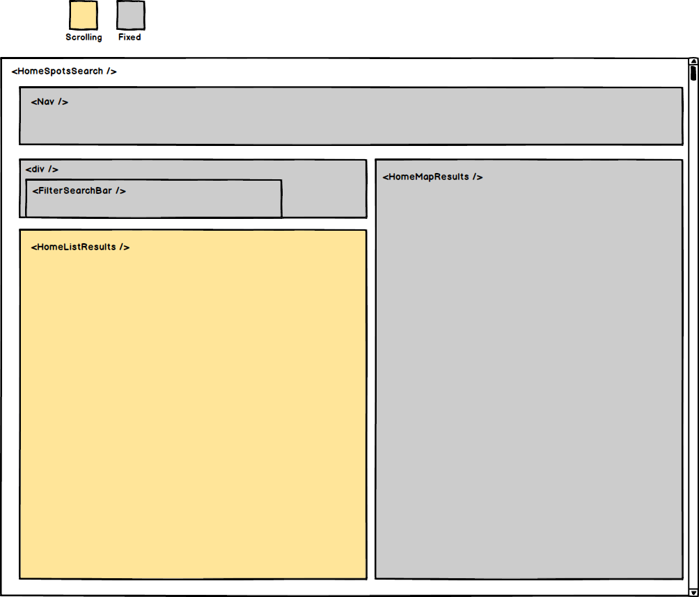

# Airbnfarm

## Overview
Airbnfarm is an app for anyone who has ever wished Airbnb only had farms.

The app connects farm owners who have available lodging to adventurers who appreciate rural life. All app users have "guest" and "host" functionality in the same account.

Hosts can create `spots`, which are then available for viewing by guests, who can send requests to book. Hosts can then review and approve/decline requests.

## Data Structure

The app's primary tables are the `users` and `spots` tables.

The `availabilities` table stores data on the availability of spots. When a host creates a spot, they specify its availability, which is stored in the `availabilities` table with an initial `is_available` value of `true`.

The `bookings` table stores data on booking requests. When a guest requests to book a spot, a row is created in the table with an initial `status` of `pending`.

"Guests" can view bookings they've requested on their "Trips" page. "Hosts" can view bookings to their spots on their "Reservations" page.

Hosts approve or decline a booking, which changes its `status` in the `bookings` table.

## Component Structure

There are three primary types of pages: `spots`, `become-a-host` and `bookings`.

### Spots

The `Spots` pages allow users to explore spots. The two pages under this route are the `profile` page, which displays details on a single spot and allows guests to request to book it, and the `search` page which allows guests to explore multiple spots based on city and availability.

The `search` page renders "mini-spots" (snapshots of spot info) in two ways: a list on the left and a map on the right.

### Become A Host

The app has a single `/become-a-host` route, which renders the `BecomeAHost` component. This page is paginated, just like Airbnb's website, allowing hosts to create a spot step-by-step. The `BecomeAHost` component renders one of three components -- `SpotFormBasics`, `spotFormDetails`, and `SpotFormAvailability` as hosts navigate between the pages. User input is persisted until submit by being stored in the `BecomeAHost` component's state.

Users are required to include a photo when creating a spot. They are prompted to select a photo from their local machine, which is then uploaded to and served by Amazon Web Services.

### Bookings

The app's `/bookings` route has three sub-routes: one for guests (`trips`, which shows their requests) and two for hosts (`listings`, which shows their spots, and `reservations`, which shows requests to their listings).

## Future Development

Future developments to Airbnfarm include:

* improving error handling
* creating profile pages for hosts and guests
* allowing guests to review spots/hosts and hosts to review guests
* allowing hosts to post additional details about spots, including more than one photo
* allowing guests to search spots based on additional criteria
