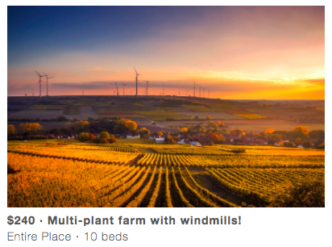
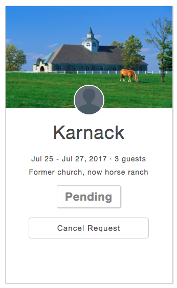
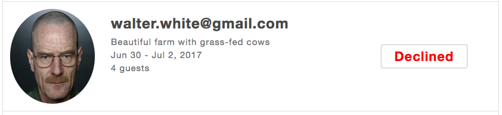
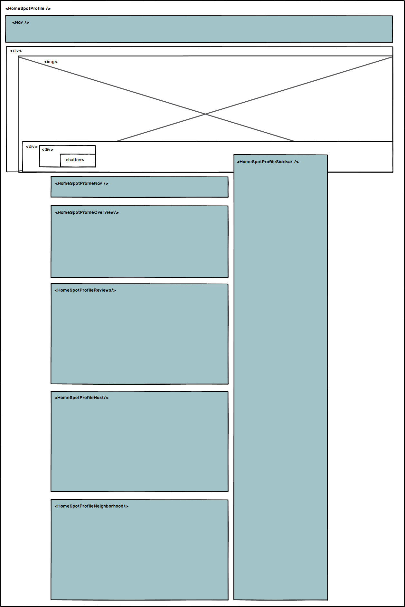
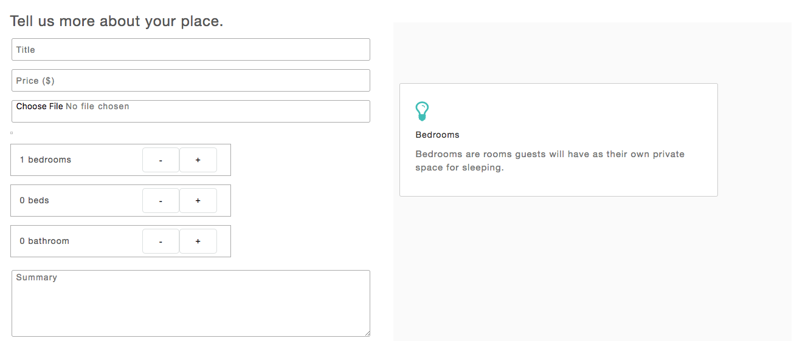
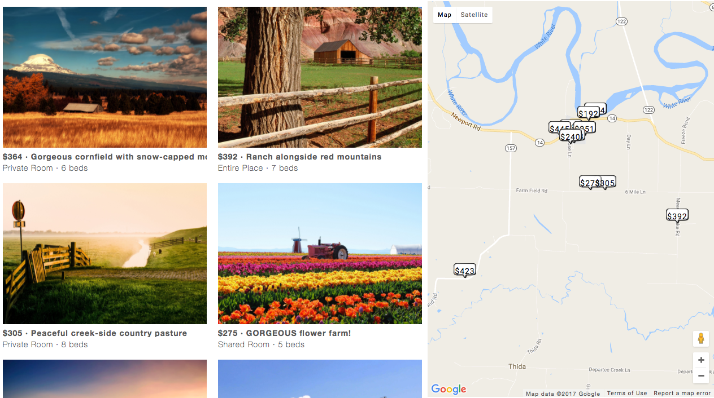
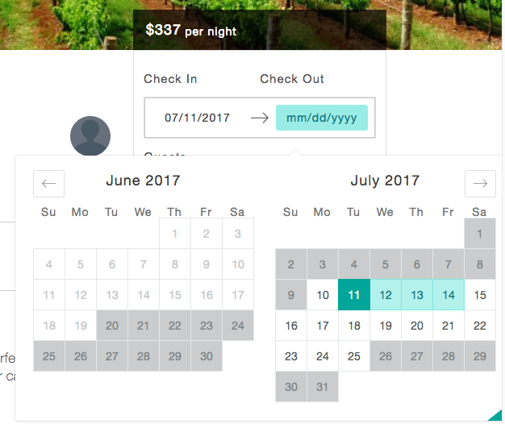
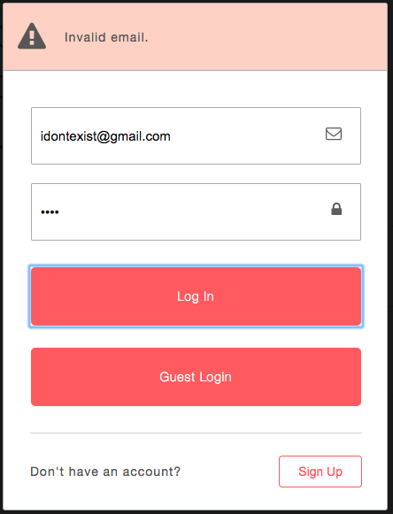

# Airbnfarm

[Live Link](http://airbn.farm/)

## Overview
[Airbnfarm](http://airbn.farm/) is an app for anyone who has ever wished Airbnb only had farms. The app seeks to precisely clone the design and functionality of Airbnb's website.

This app's frontend is powered by React and its backend by Ruby on Rails. It uses many additional languages, frameworks, technologies and libraries, including but not limited to: Ajax, PostgreSQL, Jbuilder, AWS S3, HTML5/CSS3, Figaro, BCrypt, React Dates, React Autocomplete and React Geocoder.

Airbnfarm connects farm owners who have available lodging to adventurers who appreciate rural life. All app **users** have **guest** and **host** functionality in the same account.

**Hosts** can create **spots**, which are then available for viewing by **guests**, who can send requests to book. Hosts can then review and approve/decline requests.

Put most simply, Airbnfarm (and Airbnb itself) is an interface through which **users** can create and efficiently explore each other's **spots**. All other objects (e.g. bookings, availabilities) track the state of and relationship between users and spots, and the user interface (e.g. Become A Host, Search, Listings, Trips) allows users to seamlessly explore them.

## Component Reusability

All components are optimally structured to maintain DRY code. For example:

**SpotSearchBar** is a single component reused on the homepage as well as in the nav bar of spot-related pages.

**SpotMini** is a single component that shows basic information about a spot. This component is reused on the search map, the search list, the homepage and the listings page.

**Reservation** and **Trip** are components that appear multiple times on the Reservations and Trips page, once for every reservation and trip.

<br>
**SpotMini** component example
<br><br><br>

<br>
**Trip** component example
<br><br><br>

<br>
**Reservation** component example

## Front End React Routes

The front-end React routes are optimally structured to efficiently handle the component hierarchy and avoid duplication.

For example, the nav appears at the top of every page and contains a search bar only when appearing on the spot pages (profile and search).

This is accomplished through a **Nav** component that is passed a `searchBarVisible` boolean prop.

Most pages render the Nav component normally at the top, with `searchBarVisible` as `false`. The spot pages are exceptions -- they render the Nav component by being nested under the `/spots` path, which renders the Nav component and passes it `searchBarVisible` as `true`.

The bookings page uses a similar structure, rendering the **HostPage** component, which contains content similar to the **Listings** and **Reservations** pages, and then renders content specific to those pages through nested routes.

``` javascript
<Router history={ hashHistory }>
  <Route path='/' component={App}>
    <IndexRoute component={Welcome} />

    <Route path='/spots' component={NavContainer} searchBarVisible={true}>
      <Route path='/spots/profile/:spotId' component={SpotProfileContainer}></Route>
      <Route path='/spots/search' component={SpotSearch}></Route>
    </Route>

    <Route path='/become-a-host' component={BecomeAHostContainer}></Route>

    <Route path='/bookings/trips' component={TripsPage}></Route>

    <Route path='/bookings/host' component={HostPage}>
      <Route path='/bookings/host/listings' component={ListingsPage}></Route>
      <Route path='/bookings/host/reservations' component={ReservationsPage}></Route>
    </Route>

  </Route>
</Router>
```

## Data Structure

The app's primary tables are `users` and `spots`.

The `availabilities` table stores data on the availability of spots. When a host creates a spot, they specify its availability, which is stored in the table with an initial `is_available` value of `true`.

| spot_id       | available_date           | is_available  |
| ------------- |:-------------:           | :-----:        |
| 814358        | 07/03/2018               | true          |
| 814358        | 07/04/2018               |   false       |
| 168524        | 07/03/2018               |    true       |

The `bookings` table stores data on booking requests. When a guest requests to book a spot, a row is created in the table with an initial `status` of `pending`. It also stores info from the spot when the booking was requested, in case the spot is changed by the host (e.g. base_price).

| spot_id       | status_id          | start_date    |  end_date   | num_guests |
| ------------- |:-------------:     | -----:        |  -----:     |   :-------------:   |
| 812543        | 0 (e.g. pending)   |  07/01/2018   |  07/15/2018 |      5     |
| 712342        | 1 (e.g. approved)  |  07/05/2018   |  07/20/2018 |      3     |
| 156874        | 2 (e.g. declined)  |  07/01/2018   | 07/05/2018  |      2     |

**Guests** can view bookings they've requested on their **Trips** page. **Hosts** can view bookings to their spots on their **Reservations** page.

Hosts approve or decline a booking, which changes its `status` in the `bookings` table. The corresponding `availabilities` have their `is_available` values set to `false`.

## Back-End Routes

This app uses entirely RESTful back-end api routes. These routes provide data to the frontend on spots, bookings, sessions and users, and also handle modifications and deletions.

Nested routes are used as needed (e.g. to retrieve all spots for a particular user, or to provide all bookings for a particular user or spot).

``` ruby
# routes.rb
...
namespace :api, defaults: {format: :json} do

  resources :users, only: [:create, :show] do
    resources :spots, only: [:index]
    resources :bookings, only: [:index]
  end

  resource :session, only: [:create, :destroy]

  resources :spots, only: [:create, :show, :index] do
    resources :bookings, only: [:create]
  end

  resources :bookings, only: [:show, :update]

  resources :availabilities, only: [:create, :destroy]

end
```

## Component Structure

There are three primary types of pages: `spots`, `become-a-host` and `bookings`.

### Spots

``` javascript
// root.jsx
...
<Route path='/spots' component={NavContainer} searchBarVisible={true}>
  <Route path='/spots/profile/:spotId' component={SpotProfileContainer}></Route>
  <Route path='/spots/search' component={SpotSearch}></Route>
</Route>
...
```

The `Spots` pages allow users to explore spots. The two pages under this route are the `profile` page, which displays details on a single spot and allows guests to request to book it, and the `search` page which allows guests to explore multiple spots based on location and availability.

The `profile` page, depicted below, is the most deeply nested of all React components in the app, avoiding overly complex components and allowing components to be reused.

The `search` page renders "mini-spots" (snapshots of spot info) in two ways: a list on the left and a map on the right.



### Become A Host

The app has a single `/become-a-host` route, which renders the `BecomeAHost` component. This page is paginated, just like this feature on Airbnb's website, allowing hosts to create a spot step-by-step.

The `BecomeAHost` component renders one of three components -- `SpotFormBasics`, `spotFormDetails`, and `SpotFormAvailability` as hosts navigate between the pages. User input is persisted by being stored in the `BecomeAHost` component's state. These three components modify `BecomeAHost`'s component state through a function it provides to them via props.

Users are required to include a photo when creating a spot. They are prompted to select a photo from their local machine, which is then uploaded to and served by Amazon Web Services.

The Become A Host page also replicates Airbnb's feature for rendering tips as the user completes the form. When a user begins specifying the number of bedrooms, for example, a tipbox appears with information on what is considered a bedroom. This is accomplished using a `tips` slice of the BecomeAHost component's state.

<br>
Become A Host Page

### Bookings

The app's `/bookings` route has three sub-routes: one for guests (`trips`, which shows their requests) and two for hosts (`listings`, which shows their spots, and `reservations`, which shows requests to their listings).

## Search

A key feature of Airbnfarm (and Airbnb) is the ability to explore spot. Airbnfarm allows exploration by location and availability. The interface provides users a **List** and a **Map**.

<br>
Search **List (left)** and **Map (right)**

A new search can be executed and the results stored in the Redux store via the following means:

* Search bar
* Map (movement)

The date range and map bounds variables are needed to execute a search (both optional). When the search bar is used, the map is first rendered, determining the bounds and allowing the search to then be executed. When the map is used, an event listener listens for the map to idle ([see Google's excellent documentation](https://developers.google.com/maps/documentation/javascript/events)), at which point a new search is executed.

The List simply re-renders anytime the Redux store's `searchResults` are modified. The List uses CSS floating to handle stacking and arrangement of the SpotMini components.

### Marker Management

A separate MarkerManager class is used to handle logic pertaining to the map's pins. It utilizes Google Maps InfoWindows, which contain SpotMini components.

Users might notice that when searching a location that returns at least one result, the map automatically zooms to fit all results. This is accomplished using a Google Maps `LatLngBounds` object, which is instantiated and then expanded (using `bounds.extend(position)`) to include each marker as it is created. The bound is then applied to the bound (using `map.fitBounds(bounds)`).

## Calendar

This app uses the [**React Dates** library](https://github.com/airbnb/react-dates) provided by Airbnb in the search bars and the spot profile booking sidebar.

Because this app has a unique feature for preventing double booking, dates that have been reserved or that weren't made available by the host are blocked in the calendar. This is accomplished using the `isBlocked` prop of React Dates, which is passed a function that compares every date displayed in the calendar with the availabilities of the spot.

<br>
Calendar

## Controllers and Models

The app efficiently divides responsibilities between models and controllers, allowing controllers to handle HTTP requests/responses, and models to handle data and logic. This adheres to the intended use and separation of concerns of the Rails framework.

For example, the `Spot Controller` has an `#index` action that provides data on multiple spots (either all spots matching search criteria or all spots under a particular host).

This action utilizes the model's `Spot::filter_by_availability(spots, startRequestedDate, endRequestedDate)` `Spot::all_spots_within(bounds)` methods to determine which spots to return.

``` ruby
#spot.rb
...
def self.filter_by_availability(spots, startRequestedDate, endRequestedDate)

  # select only those spots where...
  return spots.select do |spot|
    # ...each of the requested dates are in the spot's availabilities
    spot.send(:available_for?, startRequestedDate, endRequestedDate)
  end

end


def available_for?(startRequestedDate, endRequestedDate)
  availabilities = self.availabilities.where(is_available: true).map do |availability|
    availability.available_date
  end

  (startRequestedDate..endRequestedDate).all? do |requested_date|
    availabilities.include?(requested_date)
  end
end
...
```

### Jbuilder

[This app uses [Jbuilder](https://github.com/rails/jbuilder)] templates and partials to format data before it is sent via an HTTP response.

For example, a Jbuilder template prepares data on multiple bookings, which can be requested by a user (as a guest) or requested *of* a user (as a host).

The template divides these designations in a Hash structure, and then uses a Jbuilder partial to prepare each booking's data. The partial uses ActiveRecord's powerful querying methods and associations to pull all data needed (e.g. `booking.guest.email`).

``` ruby
# bookings/index.json.jbuilder

json.trips do
  @trips.each do |trip|
    json.set! trip.id do
      json.partial! 'api/bookings/booking', booking: trip
    end
  end
end

json.reservations do
  @reservations.each do |reservation|
    json.set! reservation.id do
      json.partial! 'api/bookings/booking', booking: reservation
    end
  end
end
```

``` ruby
# _booking.json.jbuilder

json.extract! booking, :id, :start_date, :end_date, :num_guests, :city, :base_price,
  :date_requested, :date_approved, :title, :guest_id

json.spot_main_photo_url booking.spot.main_photo.url
json.spot_id booking.spot.id
json.booking_status booking.status.status
json.guest_email booking.guest.email
json.guest_avatar_url booking.guest.avatar_url

```

## User Authentication and Session Management

Airbnfarm uses hand-rolled user authentication logic made using the [`BCrypt` Ruby gem hashing function](https://github.com/codahale/bcrypt-ruby).

No passwords are stored in the database. Instead, the database stores password_digests that are then verified using BCrpyt when a user attempts to log in. Methods include `User#is_password?(password)` and `User::find_by_credentials(email, password)`.

``` ruby
# user.rb
...
def is_password?(password)
  BCrypt::Password.new(self.password_digest).is_password?(password)
end
```

To allow users to stay logged in, the app drops a session token cookie in users' browser and also stores this token in the database for the user. When a user navigates the site, the user remains logged in if the cookie token matches the token in the database.

## Modal

This app utilizes a hand-rolled modal for log-in and sign-up. This is managed by a `modalReducer` as well as a `modalConductor` slice of the Redux store's state.

The modal is rendered on every single of page (via the `App` component rendered by the `/` front-end React route). However, its CSS `display` is set to `none` unless the modalConductor specifies a modal that should be made visible.

The log-in and sign-up modal contains design user interaction flow that almost precisely matches that of Airbnb's website (as of March 2017). This includes hard errors when a user fails to authenticate and soft errors when a user provided incomplete information.


User authentication soft error example


User authentication hard error example

## Future Development

Future developments to Airbnfarm include:

* improving error handling
* creating profile pages for hosts and guests
* allowing guests to review spots/hosts and hosts to review guests
* allowing hosts to post additional details about spots, including more than one photo
* allowing guests to search spots based on additional criteria
